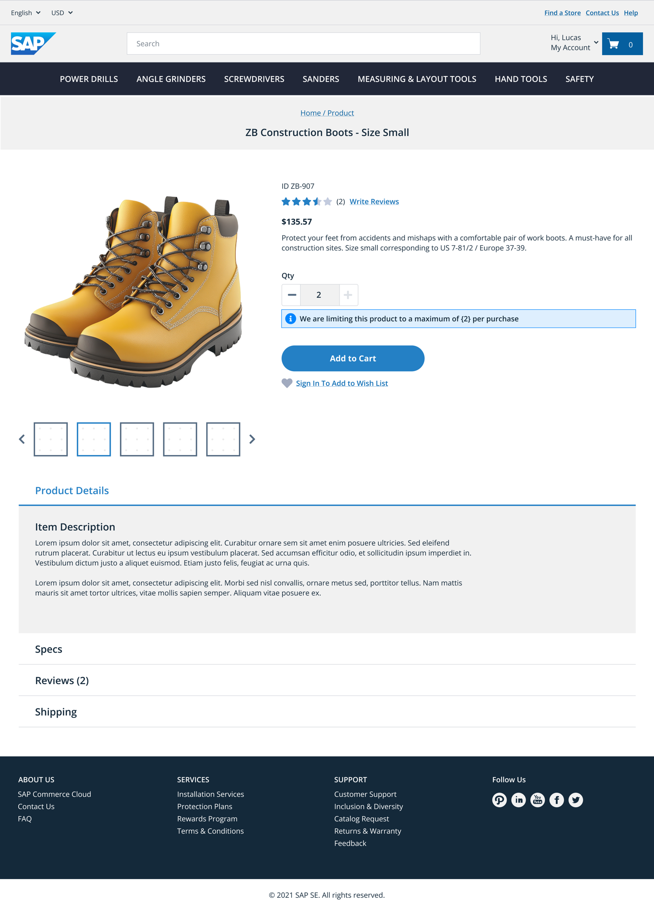

# Creating your First Extension

Use this tutorial to learn how to create your first extension in SAP Commerce Cloud, cloud ERP edition.

By the end of this tutorial, you will know how to extend core capabilities, such as cart, end-to-end by adding custom validation logic to the Storefront Cart API and customizing the storefront to handle the new validation errors in a user-friendly way.

As part of this tutorial, you will create:

- A commerce serverless function with custom cart validation logic.
- Two synchronous extensions that connect the extension points to the function.
- A storefront customization to surface the validation error in a prominent and user-friendly location.
- A plugin to bundle the commerce serverless function and synchronous extensions for easy installation in another tenant.

## Use Case

You want to restrict the quantity of certain products in a shopping cart. For example, you may want to restrict products for the following reasons:

- Limited editions
- High or increased demand
- Natural disasters or pandemics

To ensure that the products are restricted, you want to implement custom business logic to verify them before they are added to cart.

## Prerequisites

Before beginning this tutorial, ensure that you have the following:

- Access to extensibility features in your SAP Commerce Cloud, cloud ERP edition tenant. If you haven't set this up yet, complete [Accessing Extensibility Features](https://help.sap.com/docs/CC_CEE/ad2d84908ea94e9a83c3a8e7c3e41646/4eacc7c8e96c40bdb32b2aa246f1b459.html) first.
- A store and sales channel configured in your tenant, with at least one product that can be added to cart. See [Product Assistance documentation](https://help.sap.com/docs/CC_CEE/13de6c3f0122465d9cd200c05f8ed6cb/7faef0e5d6334c34877c2cbde1cf8e74.html).

## Procedure

Perform the following steps in the specified order:

1. **[Understand the End-to-End Flow](step-1-understand-end-to-end-flow.md)**  
   Familiarize yourself with the end-to-end flow of synchronous extensibility.

2. **[Explore Extension Points](step-2-explore-extension-points.md)**  
   Navigate to the Extension Points UI, find the Before Cart Creation and Before Cart Operations extension points, and review their API specifications to understand the function input and output.

3. **[Implement a Commerce Serverless Function](step-3-implement-serverless-function.md)**  
   Implement and test the custom validation logic, and package it into a ZIP file ready for upload.

4. **[Upload and Configure the Commerce Serverless Function](step-4-upload-and-configure-serverless-function.md)**  
   Upload the function to your tenant and configure the product quantity restrictions using key-value pairs.

5. **[Configure and Test Synchronous Extensions](step-5-configure-and-test-synchronous-extensions.md)**  
   Wire the Before Cart Creation and Before Cart Operations extension points to your function. Test the extensions using the Synchronous Extensibility Test capability.

6. **[Test with the Storefront Cart API](step-6-test-with-storefront-cart-api.md)**  
   Verify the quantity restriction logic works correctly by testing directly against the Storefront Cart API.

7. **[Test with the Storefront](step-7-test-with-storefront.md)**  
   Test the full end-to-end flow through the storefront. You can skip this and the next step if you only need the back-end extension.

8. **[Customize the Storefront](step-8-customize-storefront.md)**  
   The storefront already displays the error returned by the Cart API in a generic way. Customize the storefront to surface the quantity restriction message in a more prominent and user-friendly location.

9. **[View Metrics, Traces, and Logs](step-9-view-metrics-traces-and-logs.md)**  
   View metrics, traces, and logs for the core synchronous extensions and commerce serverless functions you create.

10. **[Package as a Plugin](step-10-package-as-plugin.md)**  
    Bundle created extensions and configuration into a plugin package that you can easily deploy in another tenant.

11. **[Next Steps](step-11-next-steps.md)**  
    Find out what to do and learn next.
