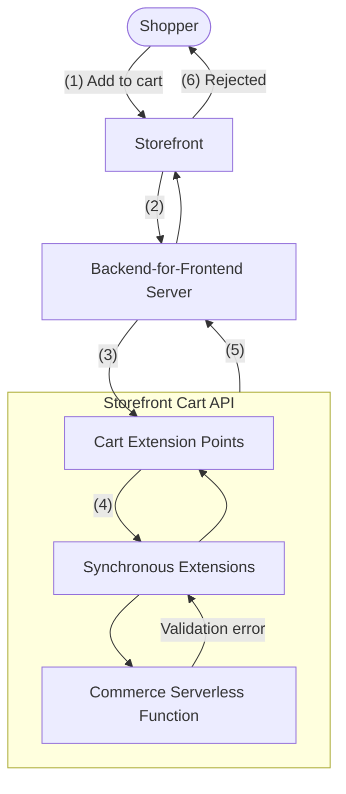

# Step 1: Understand the End-to-End Flow

This tutorial shows how to extend end-to-end by adding custom validation logic to the Storefront Cart API and customizing the storefront to handle the new validation errors in a user-friendly way. In this example, certain products are restricted to a maximum quantity per shopper.


## The Flow

1. Shopper adds a product to their cart via the storefront.
2. Storefront calls the Backend-for-Frontend Server.
3. Backend-for-Frontend Server calls the Storefront Cart API.
4. Storefront Cart API invokes synchronous extensions using the cart extension points. Each synchronous extension invokes the commerce serverless function. The function receives the configured key-value pairs as `functionConfiguration`:

   ```javascript
   export const handler = (extensionPointRequest, functionConfiguration) => {
     // functionConfiguration contains your configured key-value pairs, e.g.:
     // { "BK-135": "5", "BK-9000": "7" }
     // ... validation logic implemented later in the tutorial
   };
   ```

5. Validation fails, and the Storefront Cart API returns the error to the Backend-for-Frontend Server.
6. Shopper's add-to-cart action is rejected. The customized storefront surfaces the quantity restriction message in a prominent and user-friendly location.



## Navigation

[Back to Overview](README.md) | [Next Step →](step-2-explore-extension-points.md)
