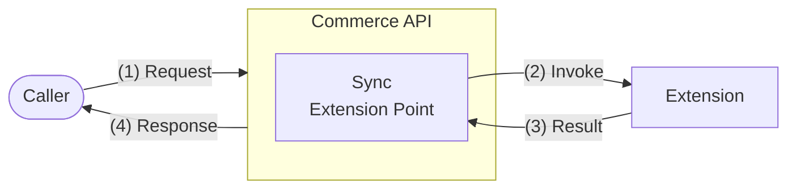

# Step 2: Explore Extension Points

Before implementing the commerce serverless function, explore the synchronous extension points you will use. Extension points are documented as OpenAPI specifications. The specification describes a **request** and a **response**. When you implement the extension as a commerce serverless function, the request payload becomes the input your function receives, and the response payload is the value your function must return.

Synchronous extension points allow you to modify business process behavior in real-time. During request processing, when the Commerce API reaches a synchronous extension point, it invokes the extension you've configured and uses the result to influence the final response:



> For cart extension points, a synchronous extension can invoke either a side-by-side extension or a commerce serverless function. In this tutorial, you use a commerce serverless function.

For this tutorial, you need two extension points:
- **Before Cart Creation** — invoked before a cart is created. Products can be added as part of cart creation.
- **Before Cart Operations** — invoked before an existing cart is updated. Products can be added, updated, or removed.

In the following procedure, you will find these extension points and review their API specifications to understand the input and output of the commerce serverless function you will implement next.

## Procedure

1. On the left menu, choose **Extensibility** > **Extension Points**.

2. Explore the **Before Cart Creation** extension point:

   a. Open the **Cart Creation** tile.

   b. On the **Before Cart Creation** card, choose **...** > **View Metadata**. The OpenAPI specification describes the contract for this extension point:
      - **Request** — for a commerce serverless function, the request payload maps to the input your function receives. For a side-by-side extension, this would be the HTTP request body sent to your API endpoint.
      - **Response** — for a commerce serverless function, the response payload maps to the value your function must return. For a side-by-side extension, this would be the HTTP response body your endpoint returns.

   c. Review the request. Your function input contains `apiContext.operations` — an array of operations the Cart API wants to perform. For this tutorial, the relevant operation is `addToCart` (with `productId` and `quantity`). There is no existing cart state — the cart is being created.

      Example request:
      ```json
      {
        "commerceContext": {
          "storeId": "sample-b2b-store"
        },
        "apiContext": {
          "operations": [
            {
              "operationId": "addToCart",
              "data": {
                "productId": "BK-135",
                "quantity": 3
              }
            }
          ]
        }
      }
      ```

   d. Review the response. To allow the operation, return an empty JSON object. To reject it, return a business validation error:

      ```json
      {
        "error": {
          "code": "quantity_limit_exceeded",
          "message": "The product with ID BK-135 has a quantity restriction in the cart set to 5.",
          "details": [
            {
              "code": "product_quantity_limit",
              "message": "BK-135",
              "target": "productId"
            },
            {
              "code": "max_quantity_allowed",
              "message": "5",
              "target": "quantity"
            }
          ]
        }
      }
      ```

      The `details` array provides structured data that the storefront can parse to display a user-friendly message to the shopper.

   > **Tip:** To learn more about how extension points handle requests and responses, see [Request and Response Handling](https://help.sap.com/docs/CC_CEE/ad2d84908ea94e9a83c3a8e7c3e41646/cd35ecbbcifca40d6beeb95c925a1bd74.html).

3. Explore the **Before Cart Operations** extension point:

   a. Go back to **Extensibility** > **Extension Points**.

   b. Open the **Cart Operations** tile.

   c. On the **Before Cart Operations** card, choose **...** > **View Metadata**.

   d. Review the request. The key difference from Before Cart Creation: the request also includes **`data.cart`** — the current cart state before operations are applied, including existing entries with `productId`, `entryId`, and `quantity`. The function needs this to calculate the total quantity after all operations. The `apiContext.operations` can include `addToCart`, `updateCartEntry`, and `deleteCartEntry`.

      Example request with `updateCartEntry`:
      ```json
      {
        "commerceContext": {
          "storeId": "sample-b2b-store"
        },
        "apiContext": {
          "operations": [
            {
              "operationId": "updateCartEntry",
              "data": {
                "entryId": "c5427f46-d3b5-4292-abd0-97ae39458a45",
                "quantity": 8
              }
            }
          ]
        },
        "data": {
          "cart": {
            "entries": [
              {
                "id": "c5427f46-d3b5-4292-abd0-97ae39458a45",
                "productId": "BK-135",
                "quantity": 2
              }
            ]
          }
        }
      }
      ```

   e. Review the response. The response format is the same as for Before Cart Creation — return `{}` to allow, or a business validation error to reject.

## Results

You are familiar with the API specifications of the **Before Cart Creation** and **Before Cart Operations** extension points. You understand:
- What the request payload contains, such as the operations and the cart state, which map to your function input.
- What the response payload must contain to allow or reject an operation, which maps to your function return value.

## Navigation

[← Previous Step](step-1-understand-end-to-end-flow.md) | [Back to Overview](README.md) | [Next Step →](step-3-implement-serverless-function.md)
