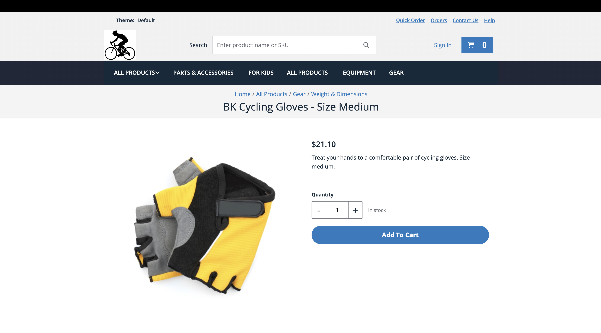
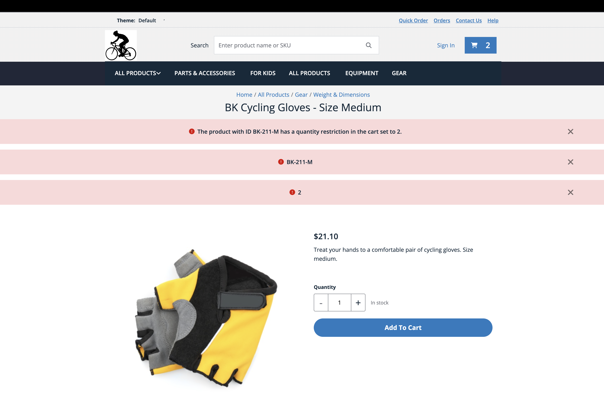

# Step 7: Test with the Storefront

Test the full end-to-end flow through the storefront.

When a shopper adds a product to cart, the storefront calls the Backend-for-Frontend (BFF) server (`POST /bff/api/spartacus.mcs.auth.cart.addToCart.v1`), which in turn calls the Storefront Cart API. When the Cart API returns a `400` error, the BFF wraps it in an `upstream` field and responds with `502`:

```json
{
  "error": {
    "json": {
      "message": "Unhandled upstream request error",
      "code": -32603,
      "data": {
        "httpStatus": 502,
        "upstream": {
          "status": 400,
          "body": {
            "error": {
              "status": 400,
              "code": "quantity_limit_exceeded",
              "message": "The product with ID BK-211-M has a quantity restriction in the cart set to 2.",
              "details": [
                { "code": "product_quantity_limit", "message": "BK-211-M", "target": "productId" },
                { "code": "max_quantity_allowed", "message": "2", "target": "quantity" }
              ]
            }
          }
        }
      }
    }
  }
}
```

The storefront's generic error handler displays the main error `message` and each entry in the `details` array as separate banner messages. You can observe this request and response in your browser's network tab.

> Storefront APIs are intended to be integrated via the BFF, not called directly from the frontend. For more details, see [About the Backend-for-Frontend Server](https://help.sap.com/docs/COMMERCE_CLOUD_MANAGED_EDITION/24176fb554b4410caf1bcd0c6c7cf633/60081e43e98d43b4b810811c7136a808.html).

> For more details on how the BFF handles and propagates upstream errors, see [BFF Error Handling](https://help.sap.com/docs/COMMERCE_CLOUD_MANAGED_EDITION/24176fb554b4410caf1bcd0c6c7cf633/983d0a2467854a69b7cdbf2dca99a16f.html).

> For more details on how the storefront handles validation errors from core synchronous extensions, see [Request and Response Handling](https://help.sap.com/docs/COMMERCE_CLOUD_MANAGED_EDITION/2bde64d55a304fe19cd6be4a2bc303d6/cd35ecbbcfca40d6beeb95c925a1bd74.html).

## Prerequisites

- A configured and running local copy of the storefront project. For setup instructions, see [Storefront Development Setup](https://help.sap.com/docs/CC_CEE/098d0a4925094840a656c02370c78e30/6698db3d8f92441ca3f364879e6bb4cf.html).

## Procedure

1. Open your storefront at `{storefrontUrl}` and navigate to the product detail page for a product you configured with a quantity restriction.

   

2. Add the product to cart. Keep adding until you exceed the configured quantity limit. The storefront displays error banners from the validation error returned by your extension:

   

## Results

The quantity restriction error from the Before Cart Operations synchronous extension is surfaced in the storefront. The first add-to-cart action created a new cart and invoked the Before Cart Creation extension without triggering a validation error. Each subsequent add-to-cart action invoked the Before Cart Operations extension, and, once the configured limit was exceeded, it returned the quantity restriction error.

However, the default error display is generic. It renders the raw `message` and each `details` entry as separate banners, which is not user-friendly. In the next step, you will customize the storefront to display this error in a more prominent and helpful way.

## Navigation

[← Previous Step](step-6-test-with-storefront-cart-api.md) | [Back to Overview](README.md) | [Next Step →](step-8-customize-storefront.md)
