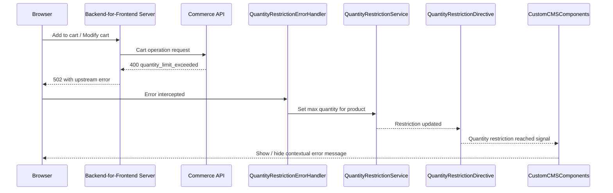

# Step 8: Customize the Storefront

The storefront already displays the error returned by the Cart API, but in a generic way. Customize the storefront to surface the quantity restriction message in a more prominent and user-friendly location.

## Prerequisites

- A configured and running local copy of the storefront project. For setup instructions, see [Storefront Development Setup](https://help.sap.com/docs/CC_CEE/098d0a4925094840a656c02370c78e30/6698db3d8f92441ca3f364879e6bb4cf.html).

## How It Works

To customize how the quantity restriction error is displayed, you need to create custom CMS components responsible for adding products to the cart and for displaying the cart contents, and replace the storefront's default error handler with one that intercepts quantity validation errors. The custom implementations are already prepared in the `product-quantity-restriction-storefront-customization/custom` directory — no manual component creation is required as part of this tutorial.

### Component Interaction

The diagram below illustrates how the components interact when a quantity restriction is exceeded. Note that the diagram is simplified and does not include details about the extension function invocation.



When a shopper adds a product to cart or modifies the cart, the storefront calls the BFF, which calls the Commerce API. When the quantity limit is exceeded, the Commerce API returns a `400` error. The BFF wraps this in an `upstream` field and responds with `502`.

On the storefront side:

1. [`QuantityRestrictionErrorHandler`](../product-quantity-restriction-storefront-customization/custom/quantity-validation/handlers/quantity-restriction-error-handler.ts) intercepts the error. When it detects a quantity limit violation, suppresses the generic error banner, and sends the (product id + maximum quantity) to `QuantityRestrictionService`.
2. [`QuantityRestrictionService`](../product-quantity-restriction-storefront-customization/custom/quantity-validation/services/quantity-restriction.service.ts) maintains the known maximum limits for each product. Also calculates the available quantity based on the current state of the cart.
3. [`QuantityRestrictionDirective`](../product-quantity-restriction-storefront-customization/custom/quantity-validation/directives/quantity-restriction.directive.ts) is applied to the `cx-item-counter` inside each custom component. It reads the available quantity from the service, caps the counter's maximum, and emits a `quantityRestrictionReached` signal when the shopper reaches the restriction.
4. The [custom CMS components](../product-quantity-restriction-storefront-customization/custom/quantity-validation/components) responsible for adding products to the cart and for displaying the cart contents. They listen to the `quantityRestrictionReached` signal from the directive and display a [`QuantityValidationMessageComponent`](../product-quantity-restriction-storefront-customization/custom/quantity-validation/components/quantity-validation-message/quantity-validation-message.component.ts) next to the relevant UI element.

## Procedure

1. Copy the contents of [product-quantity-restriction-storefront-customization/custom folder](../product-quantity-restriction-storefront-customization/custom/) into the `apps/storefrontapp/src/app/custom` directory of your storefront project.
    ```bash
      cp -r ../product-quantity-restriction-storefront-customization/custom/* \
        <path-to-storefront>/apps/storefrontapp/src/app/custom/
    ```

2. In your storefront project, open `apps/storefrontapp/src/app/app.module.ts` and make the following changes:

   a. Replace the default error handler registration with the quantity-aware handler.

      Replace:
      ```typescript
      provideErrorHandlers(),
      {
        provide: HTTP_ERROR_HANDLER,
        useClass: UpstreamBadRequestErrorHandler,
        multi: true,
      },
      ```

      With:
      ```typescript
      provideErrorHandlers(),
      {
        provide: HTTP_ERROR_HANDLER,
        useClass: QuantityRestrictionErrorHandler,
        multi: true,
      },
      ```

   b. Register the custom CMS component mappings by adding the following to the `providers` array:

      ```typescript
      provideConfig({
        cmsComponents: {
          ProductAddToCartComponent: {
            component: CustomAddToCartComponent,
          },
          CartComponent: {
            component: CustomCartDetailsComponent,
          },
        },
      }),
      provideConfig({
        launch: {
          ADDED_TO_CART: {
            inlineRoot: true,
            component: CustomAddedToCartDialogComponent,
            dialogType: DIALOG_TYPE.DIALOG,
          },
        },
      } as LayoutConfig),
      ```

3. In your storefront project, open `apps/storefrontapp/src/app/spartacus/spartacus-configuration.module.ts` and register the i18n translation resources required for the quantity validation message to display. Add the following to the `providers` array:

   ```typescript
   provideConfig(<I18nConfig>{
     i18n: {
       resources: {
         en: {
           quantityValidation: {
             quantityValidation: {
               maxQuantityMessage:
                 'We are limiting this product to a maximum of {{ maxQuantity }} per purchase.',
             },
           },
         },
       },
       chunks: { quantityValidation: ['quantityValidation'] },
     },
   }),
   ```

4. Verify the customization in the browser:

   a. Navigate to the product detail page for a product that has a quantity restriction configured. Add the product to cart until the configured limit is exceeded. Verify that a contextual error message appears instead of a generic error banner.

   b. Navigate to the cart contents page. Update the quantity of a restricted product to exceed the configured limit. Verify that a contextual error message appears next to that product in the cart.

## Results

The storefront now intercepts quantity restriction errors and displays a contextual message directly on the product detail page and in the cart contents view, instead of showing generic error banners.

## Navigation

[← Previous Step](step-7-test-with-storefront.md) | [Back to Overview](README.md) | [Next Step →](step-9-view-metrics-traces-and-logs.md)
